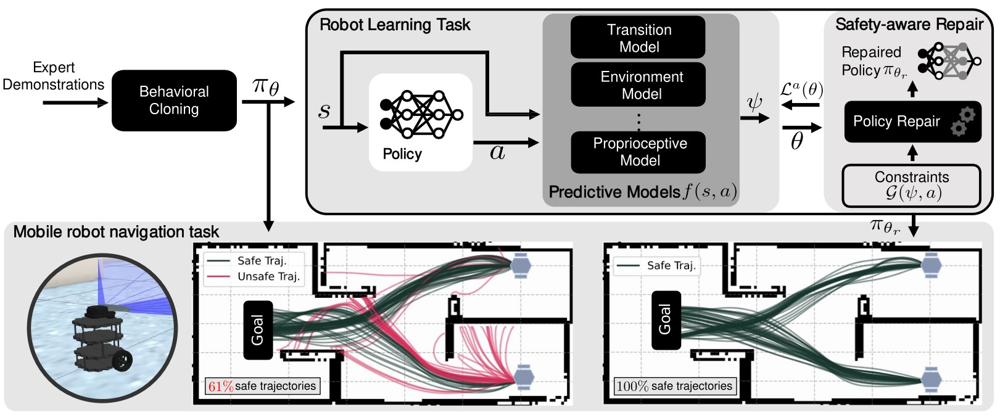

# Safety-Aware Repair with Predictive models

## Introduction
This repo includes the code for Safety-Aware Repair with Predictive models (SARP).
The proposed method combines behavioral cloning with neural network repair in a two-step supervised learning framework. 
In the first step, a policy is learned from expert demonstrations, while the second step utilizes a predictive model to impose safety constraints on the policy by repairing its predicted system properties. 
The incorporation of predictive models eliminates the need for repeated interaction with the robot, saving time on lengthy simulations typically required in reinforcement learning. 
The predictive models can encompass various aspects relevant to robot learning applications, such as proprioceptive states and collision possibilities. 
This repo showcase the implementation of SARP in two different applications: robot collision avoidance in a hospital simulation and regulation of pressure and action rate in real-world lower-leg prostheses. 

## Setup
We use the Poetry tool which is a dependency management and packaging tool in Python. It allows you to declare the libraries your project depends on and it will manage (install/update) them for you. Please follow the installation of poetry [here](https://python-poetry.org/docs/#installation). After you've installed poetry, you can install SARP by running the following command in the root of the project:

    poetry install

## Quick Start
Before running the examples, please download the full dataset from: [dataset link](https://drive.google.com/drive/folders/1SELQ2BnnqfwDSjb59tPyDQ6iak-kcBTm?usp=sharing). Locate each `/data` folder under the main subfolder for each example. 

### Training
Scripts for pre-training the policy and predictive models are located under each example subfolder. For example, to pre-train a policy for the hospital showcase run [0_pretrain_policy.py](examples/1_hospital_simulation/0_pretrain_policy.py). Also, to train the predictive model run [1_pretrain_predictive_model.py](examples/1_hospital_simulation/1_pretrain_predictive_model.py).

### Repairing with SARP
For learning how to repair using SARP, please follow the repair notebook tutorials under each example subfolder: [2_sarp_repair.ipynb](examples/1_hospital_simulation/2_sarp_repair.ipynb), [3_sarp_repair_full_obs.ipynb](examples/2_lower_leg_prosthesis/3_sarp_repair_full_obs.ipynb), and [3_sarp_repair_partial_obs.ipynb](examples/2_lower_leg_prosthesis/3_sarp_repair_partial_obs.ipynb).